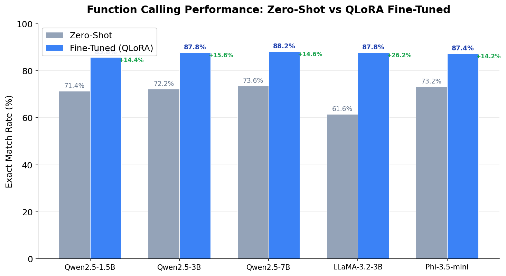
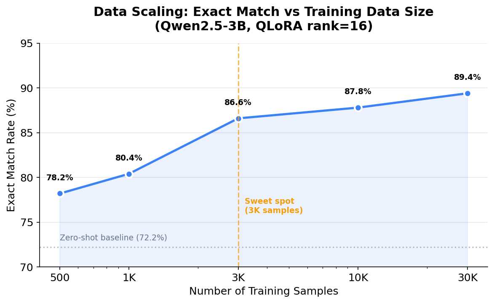

# 🔧 Small LLMs as Tool-Use Agents

**A systematic study of parameter-efficient fine-tuning for function calling in small language models (1.5B–7B)**

[](https://www.python.org/downloads/)
[](https://opensource.org/licenses/MIT)
[](https://colab.research.google.com/)

## Quick Start
```bash
git clone https://github.com/XIECHENG6/small-llms-tool-use
cd small-llms-tool-use
pip install -r requirements.txt

# Fine-tune Qwen2.5-3B with 3K samples (recommended)
python src/train.py --model Qwen2.5-3B-Instruct --data_size 3000

# Evaluate
python src/evaluate.py --model_path ./output
```

## Key Findings

> **QLoRA fine-tuning with just 3K examples enables a 1.5B model to achieve 86.6% exact match on function calling — only 2.8% below a 7B model (89.4%). Fine-tuned models generalize to completely unseen functions, achieving 91.8% exact match on functions never seen during training.**

<p align="center">
  
</p>

### Highlights

- **Architecture convergence**: After fine-tuning, all models converge to 85–89% exact match regardless of base architecture (Qwen, LLaMA, Phi), despite 12% variation in zero-shot performance
- **Efficient scaling**: 1.5B parameters achieve 85.8% — only 2.4% below 7B, suggesting function calling is a task where small models punch well above their weight
- **Data efficiency**: 3,000 training examples reach 86.6%, capturing 90%+ of the gains from 30,000 examples
- **LoRA insensitivity**: Rank 4 to 64 (16× parameter difference) yields only 1.2% variation — rank 4 is sufficient
- **Strong generalization**: On held-out functions never seen during training, the model achieves 91.8% exact match (vs 86.0% on seen functions)
- **Bridging the gap**: LLaMA-3.2-3B gains +26.2% from fine-tuning (vs Qwen's +14–16%), showing QLoRA can compensate for weaker native tool-use ability

## Results

### Multi-Model Comparison

| Model | Params | Zero-Shot | Fine-Tuned | Δ |
|-------|--------|-----------|------------|---|
| Qwen2.5-1.5B-Instruct | 1.5B | 71.4% | 85.8% | +14.4% |
| Qwen2.5-3B-Instruct | 3B | 72.2% | 87.8% | +15.6% |
| **Qwen2.5-7B-Instruct** | **7B** | **73.6%** | **88.2%** | **+14.6%** |
| LLaMA-3.2-3B-Instruct | 3B | 61.6% | 87.8% | +26.2% |
| Phi-3.5-mini-instruct | 3.8B | 73.2% | 87.4% | +14.2% |

### Data Scaling

| Training Samples | Exact Match | Marginal Gain |
|-----------------|-------------|---------------|
| 500 | 78.2% | — |
| 1,000 | 80.4% | +2.2% |
| 3,000 | 86.6% | +6.2% |
| 10,000 | 87.8% | +1.2% |
| 30,000 | 89.4% | +1.6% |

<p align="center">
  
</p>

### LoRA Rank Ablation

| LoRA Rank | Alpha | Exact Match |
|-----------|-------|-------------|
| 4 | 8 | 87.2% |
| 8 | 16 | 87.6% |
| 16 | 32 | 87.8% |
| **32** | **64** | **88.4%** |
| 64 | 128 | 87.8% |

Total spread: only 1.2% across 16× parameter range. Function calling requires minimal LoRA capacity.

### Held-Out Function Evaluation (Generalization Test)

10 functions completely excluded from training, tested on 500 unseen samples:

| Metric | Seen Functions | Unseen Functions | Gap |
|--------|---------------|-----------------|-----|
| JSON Valid Rate | 100.0% | 100.0% | 0.0% |
| Function Name Acc | 100.0% | 99.8% | 0.2% |
| Arg Names Acc | 97.2% | 97.6% | −0.4% |
| **Exact Match Rate** | **86.0%** | **91.8%** | **−5.8%** |

The model achieves *higher* accuracy on functions it has never seen, confirming it learned generalizable function calling skills rather than memorizing training data.

**Per-function accuracy (unseen):**

| Function | Accuracy | Samples |
|----------|----------|---------|
| calculate_bmi | 100% | 104 |
| calculate_distance | 100% | 95 |
| get_stock_price | 100% | 72 |
| get_movie_details | 100% | 49 |
| calculate_area | 98% | 47 |
| search_recipe | 85% | 20 |
| translate_text | 84% | 19 |
| generate_qr_code | 76% | 76 |
| send_email | 11% | 18 |

## Method

### Training Pipeline

```
Glaive Function Calling v2 (113K samples)
    → Parse & filter (57K valid function calls)
    → Format with EOS token
    → QLoRA 4-bit fine-tuning
    → Evaluate (JSON validity, name/arg accuracy, exact match)
```

### Configuration

| Component | Setting |
|-----------|---------|
| Quantization | QLoRA 4-bit (NF4, double quantization) |
| LoRA rank / alpha | 16 / 32 |
| LoRA targets | All attention + MLP projections |
| Learning rate | 2e-4 (cosine schedule) |
| Optimizer | Paged AdamW 8-bit |
| Batch size | 16 (effective) |
| Max sequence length | 512 tokens |
| Training epochs | 3 |

## Quick Start

### Installation

```bash
pip install -r requirements.txt
```

### Fine-tune a model

```bash
python src/train.py \
    --model_id Qwen/Qwen2.5-3B-Instruct \
    --train_samples 10000 \
    --lora_rank 16 \
    --epochs 3 \
    --output_dir ./output/qwen25_3b
```

### Evaluate

```bash
python src/evaluate.py \
    --model_id Qwen/Qwen2.5-3B-Instruct \
    --adapter_path ./output/qwen25_3b \
    --test_samples 500
```

### Inference demo

```bash
python demo/inference.py \
    --model_id Qwen/Qwen2.5-3B-Instruct \
    --adapter_path ./output/qwen25_3b
```

```
User: What's the weather like in Tokyo?

Available functions:
- get_weather(city: str, unit: str)
- search_restaurant(location: str, cuisine: str)

Model output:
{"name": "get_weather", "arguments": {"city": "Tokyo", "unit": "celsius"}}
```

### Run in Colab

Open `notebooks/FC_FineTune_v3.ipynb` in Google Colab with an L4 GPU. All experiments can be reproduced by modifying the configuration cell.

## Project Structure

```
fc-finetune/
├── README.md
├── requirements.txt
├── LICENSE
├── src/
│   ├── train.py          # Training script
│   ├── evaluate.py       # Evaluation with 5 metrics
│   ├── data_utils.py     # Glaive dataset parsing & formatting
│   └── inference.py      # Single-sample inference
├── demo/
│   └── inference.py      # Interactive demo
├── notebooks/
│   ├── FC_FineTune_v3.ipynb      # Main training notebook
│   └── FC_HeldOut_Evaluation.ipynb  # Generalization test
├── results/
│   ├── figures/           # Generated charts
│   ├── all_results.json   # All experiment results
│   └── generate_figures.py
└── scripts/
    └── run_experiments.sh # Reproduce all experiments
```

## Technical Notes

### The "Repetition Generation" Problem

In our initial experiments (v2), the model achieved only 58.6% exact match. Error analysis revealed that ~70% of failures were caused by the model generating a correct JSON object followed by additional unwanted JSON outputs.

**Root cause**: The training data lacked explicit stop signals after the function call.

**Solution (v3)**: Adding the EOS token after each function call in training data, combined with improved JSON extraction (first-object-only parsing) and stop sequences during inference, boosted exact match from 58.6% to 87.8% — a 29.2% improvement without changing the model or hyperparameters.

This finding highlights that **evaluation methodology and training data formatting can impact results more than model selection or hyperparameter tuning**.

## Citation

If you find this work useful, please cite:

```bibtex
@misc{fc-finetune-2026,
  title={Small LLMs as Tool-Use Agents: A Systematic Study of Parameter-Efficient Fine-Tuning for Function Calling},
  author={ChengXie},
  year={2026},
  url={https://github.com/XIECHENG6/small-llms-tool-use}
}
```

## License

MIT
